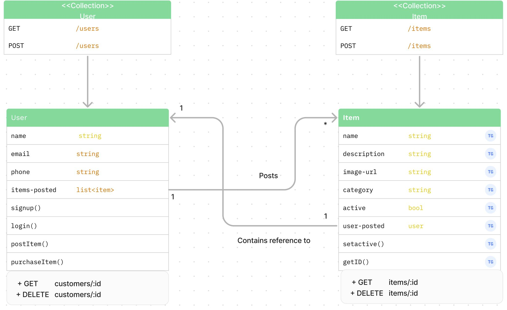

# freeStuff
An app for Cal Poly SLO students to give away and receive items for free. Basic MVP delivered with ability to post items, looks for other items, and delete items once they have transferred hands.

## Product Vision
 For any person who wants to get or give away free stuff. The website is an app that provides a platform for users to connect with each other. Unlike meeting people in person, our product provides a streamlined, centralized place to browse and post free items. git 

## UI Prototype
[Figma Pototype](https://www.figma.com/file/geIHkQuwUjqmJExvTwqXiT/307-Prototype?type=design&node-id=0%3A1&mode=design&t=ZoNPEpnOp2Q9IWh2-1)

## Development Environments

### Frontend
[website](https://delightful-island-0985f9e1e.4.azurestaticapps.net)

### Backend
[server](https://freestuff-api.azurewebsites.net/)

## Class Diagrams (UML)

